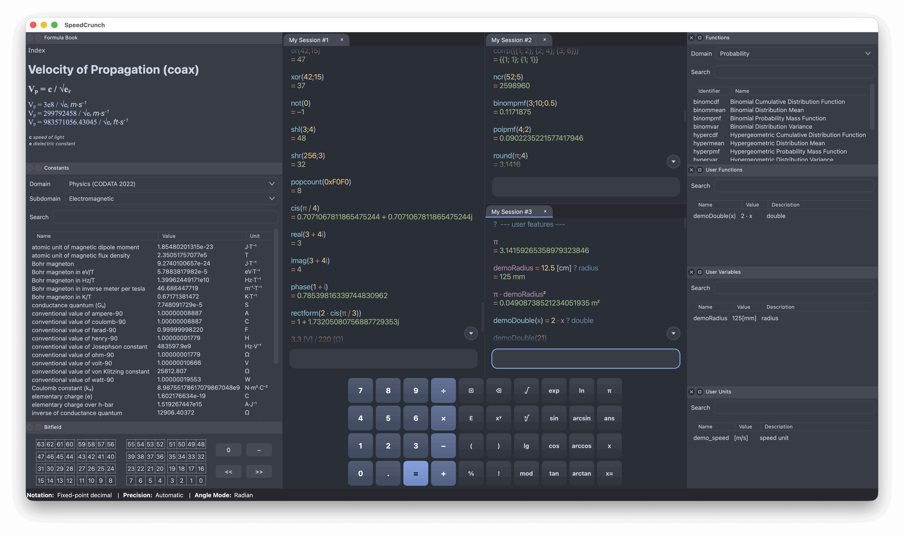

# SpeedCrunch
SpeedCrunch is a high-precision scientific calculator.
It features a syntax-highlighted scrollable display and is designed to be fully used via keyboard. Some distinctive
features are auto-completion of functions and variables, a formula book, and quick
insertion of constants from various fields of knowledge. It is available for Windows, macOS,
and Linux in a number of languages.

Visit the [SpeedCrunch website](https://www.speedcrunch.org/) for
[downloads](https://www.speedcrunch.org/download.html) and the
[online manual](https://www.speedcrunch.org/introduction.html).

## Building

See [BUILDING.md](BUILDING.md) for requirements and instructions on building,
running the tests, installing SpeedCrunch, and packaging it. The guide also
links to instructions for building the manual.

## File locations
SpeedCrunch uses [Qt's standard per-user locations](https://doc.qt.io/qt-6/qstandardpaths.html)
for persistent application data and configuration:

| Platform | Application data | Preferences/configuration |
| --- | --- | --- |
| macOS | `~/Library/Application Support/SpeedCrunch/` | `~/Library/Preferences/SpeedCrunch/` |
| Windows | `%APPDATA%\SpeedCrunch\` | `%APPDATA%\SpeedCrunch\` |
| Linux | `$XDG_DATA_HOME/SpeedCrunch/` (usually `~/.local/share/SpeedCrunch/`) | `$XDG_CONFIG_HOME/SpeedCrunch/` (usually `~/.config/SpeedCrunch/`) |

Qt respects system-specific overrides to these locations. In the Windows portable build,
application data and preferences/configuration are all stored in the same directory as
the portable application.

## Contributing
- Report bugs, request features or implement a ticket from the [issue tracker](https://speedcrunch.org/issues.html).
- Be part of the [community](https://speedcrunch.org/community.html).
- [Donate](https://www.speedcrunch.org/donate.html) to help supporting the expenses of server hosting, internet domain and computers for further development.

## License
This program is free software; you can redistribute it and/or modify it
under the terms of the GNU General Public License as published by the
Free Software Foundation; either version 2 of the License, or (at your
option) any later version.

This program is distributed in the hope that it will be useful, but
WITHOUT ANY WARRANTY; without even the implied warranty of MERCHANTABILITY
or FITNESS FOR A PARTICULAR PURPOSE.  See the GNU General Public License
for more details.

You should have received a copy of the GNU General Public License along
with this program; see the file [LICENSE](LICENSE).  If not, write to the Free
Software Foundation, Inc., 51 Franklin Street, Fifth Floor, Boston,
MA 02110-1301, USA.
